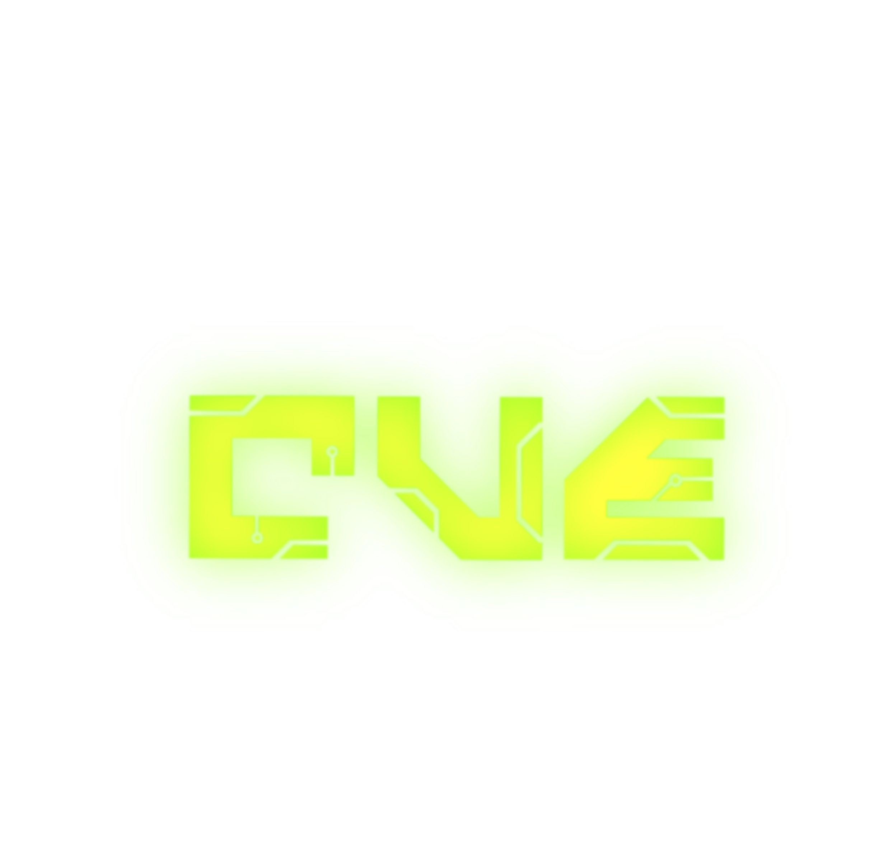
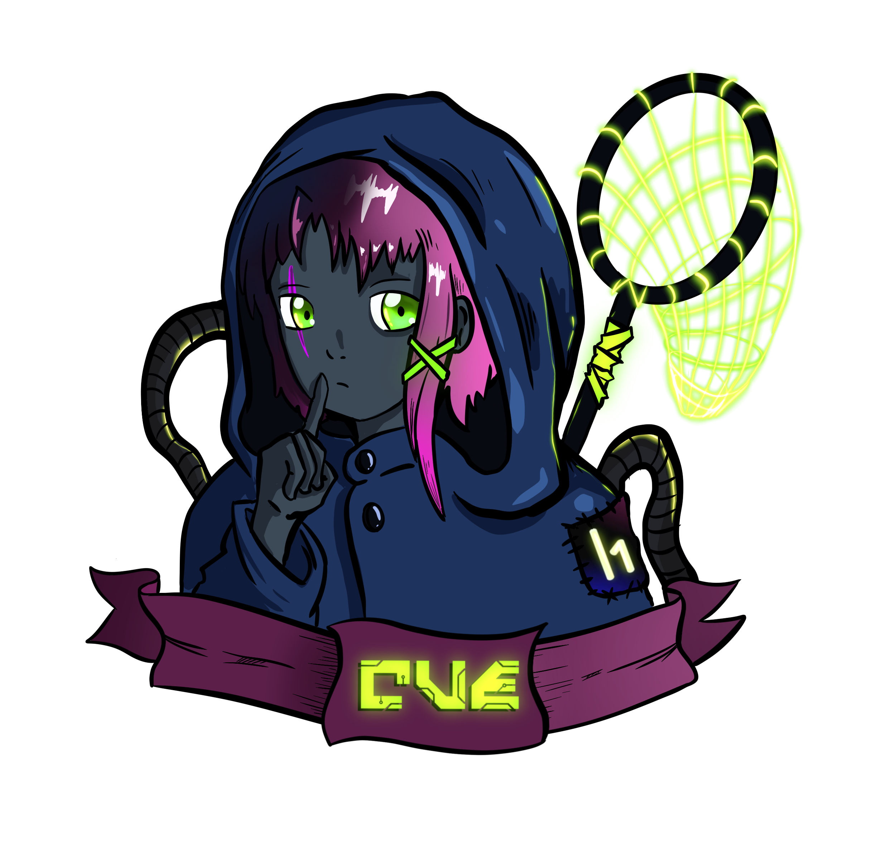

<div align="center">

<!-- LOGO -->



<br/>


</div>


---

<div align="center">
  
</div>

## `Who We Are`
<div align="center">
  
</div>
> **CVE Team** is an underground crew of offensive security researchers.  
> We track vulnerabilities, reverse binaries, pwn machines — and document everything.

We tryhard HackTheBox, chase certifications and **Pro Labs**, and never stop learning.  
Every CVE is a story. Every pwned machine is a lesson.  
We operate under a strict **ethical framework** — responsible disclosure only, no black hat activity.  
Our mission: find vulnerabilities before they find you, and make the internet a safer place.


> [!CAUTION]
> **ETHICAL DISCLAIMER**  
> CVE Team operates strictly within the boundaries of ethical security research.  
> All tools, exploits, and research published in this organization are intended **solely for educational and authorized security testing purposes**.  
> We do not condone, support, or engage in any form of illegal or unauthorized activity.  
> Responsible disclosure is our standard — always.


---

## `cat /etc/team.conf`

| Paramètre | Valeur |
|-----------|--------|
| 🎯 **Focus** | Vulnerability Research · CVE Analysis · Exploit Dev |
| 🧠 **Mindset** | Learn → Break → Document → Share |
| 🏆 **Arena** | HackTheBox · Pro Labs · CTFs |
| 🔐 **Ethics** | Responsible Disclosure Only |
| 👥 **Profile** | [HTB Team #7909](https://app.hackthebox.com/teams/7909) |
| 💬 **Discord** | [Join the shadows](https://discord.gg/QHkt7NeVtR) |

---

## `ls -la /repos`

```bash
drwxr-x--- CVE-Hunter/        # Automated CVE scanner & notifier         [WIP 🚧]
drwx------ Exploit-DB-Mirror/ # Curated & verified exploits mirror        [PRIVATE 🔒]
drwxr-x--- Neon-Scanner/      # Custom vuln scanner written in Rust        [STARTING 🌱]
drwxr-x--- Writeups-2026/     # Detailed CVE & machine breakdowns          [ACTIVE 📝]
drwxr-x--- PoC-Vault/         # Proof-of-Concepts — use responsibly        [ACTIVE ⚠️]
```

> *More incoming... `git pull` and stay tuned.*

---

## `./skills --list`

```
[■■■■■■■■■■] Web Application Pentesting
[■■■■■■■■░░] Binary Exploitation
[■■■■■■■■■░] Active Directory Attacks
[■■■■■■■░░░] Malware Analysis / Reverse Engineering
[■■■■■■■■■■] CVE Research & Disclosure
[■■■■■■■■░░] Network Forensics
[■■■■■■■■■░] CTF — Jeopardy & Attack/Defense
```

---

## `cat /var/log/certifications.log`

```
[2025-xx-xx] OSCP  — Offensive Security Certified Professional    [ TARGET ]
[2025-xx-xx] CPTS  — HackTheBox Certified Penetration Tester      [ TARGET ]
[2025-xx-xx] CWEE  — HackTheBox Certified Web Exploitation Expert [ TARGET ]
[202x-xx-xx] eCPPT — eLearnSecurity                               [ TARGET ]
```

> *We don't just collect certs. We earn them.*

---

## `tail -f /var/log/activity.log`

<div align="center">


</div>

---

## `nmap --join CVETeam`

```
Starting Nmap scan on CVETeam network...

PORT     STATE   SERVICE
443/tcp  open    discord   → https://discord.gg/QHkt7NeVtR
8888/tcp open    htb       → https://app.hackthebox.com/teams/7909

[ ] Are you ready to hunt ?
[>] Drop by the Discord — we don't bite. (machines do.)
```

<div align="center">

[](https://discord.gg/QHkt7NeVtR)
[](https://app.hackthebox.com/teams/7909)

</div>

---

<div align="center">


```
> We hunt vulnerabilities before they hunt you.
> CVE Team — Silent. Neon. Deadly.
> © 2026 — All exploits reserved.
```


</div>
